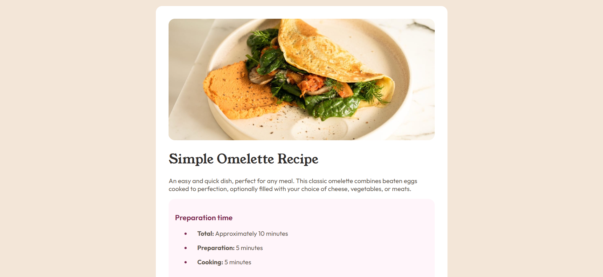

# Recipe page

This is a solution to the [Recipe page challenge on Frontend Mentor](https://www.frontendmentor.io/challenges/recipe-page-KiTsR8QQKm). Frontend Mentor challenges help you improve your coding skills by building realistic projects. 

## Table of contents

- [Links](#links)
- [My process](#my-process)
  - [Built with](#built-with)
  - [What I learned](#what-i-learned)
- [Author](#author)

## Links

- Solution URL: [Add solution URL here](https://github.com/Thunderer9506/RECIPE-PAGE-MAIN)

## My process

### Built with

- Semantic HTML5 markup
- CSS custom properties
- Flexbox

### What I learned

 - How to make a website responsive using screen media breakpoints
 - How to customize < li> in < ol> and < ul> using markers

```css
.li::marker {
  color: papayawhip;
}
```
```css
@media (max-width: 390px){
    body: 1rem;
}
```

## Author

- Github - [Thunderer9506 ](https://github.com/Thunderer9506)
- X.com - [Code.py](https://x.com/ShauryaSri88742)
- Linkedin - [Shaurya Srivastava](https://www.linkedin.com/in/shaurya-srivastava001/)
